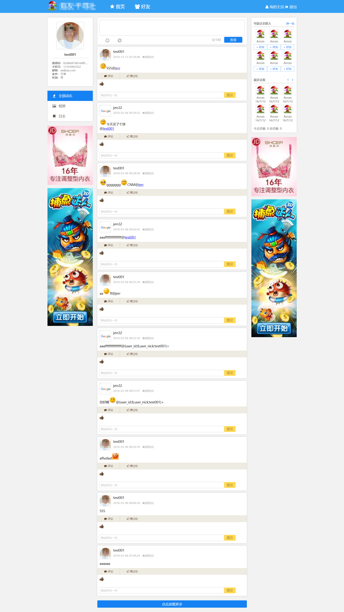
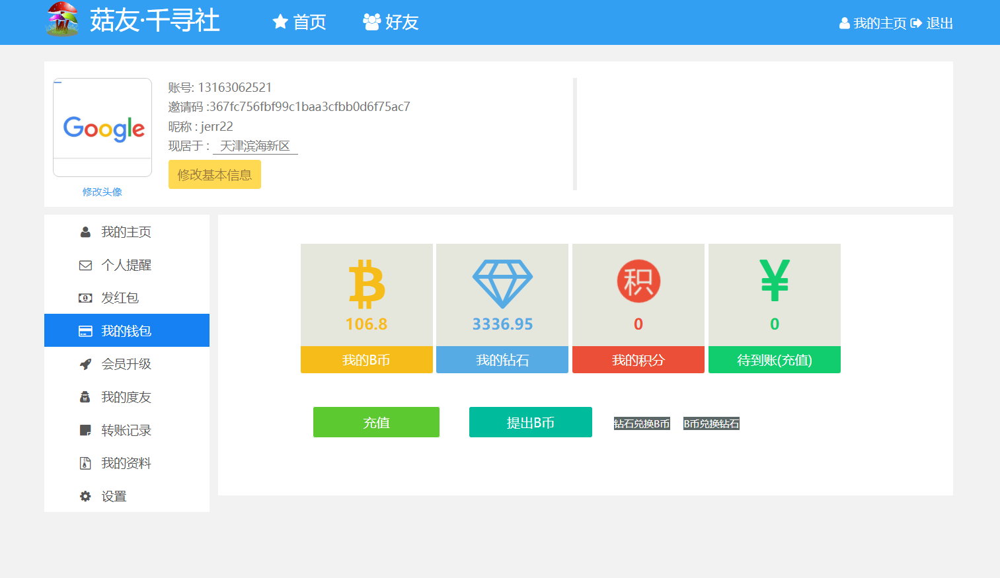

# 菇友·基于codeigniter2.x 的一个社交网站

## 声明

* 本项目仅用于学习
* 并非最新版本，存在许多未修复 bug 以及一些未完成的功能
* 开发于 很久很久以前(大二?)
* 整理于 2018/12/21 日

## 版本要求

* PHP5.6
* Mysql5.7
* Apache2.*

## 安装

* 导数 `guyou.sql` 数据库文件
* 配置 application/config/database.php
* 配置 Apache 服务器 vhost 到入口文件
* uploads 目录写入权限
* xx.com——主页
* xx.com/admin  后台，admin/admin

## 功能

* 相册
* 说说
* 日志
* 好友
* 钱包
* 广告
* ...

## 配色

- cgreen : rgba(118,204,53, 1); / #76cc35
- cyellow : rgba(255,217,82,1); / #ffd952
- cred : rgba(242,29,29,1); / #f21d1d
- cblue : rgba(51,159,242,1); / #339ff2
- cgrow : rgba(110,77,50,1); / #6e4d32

## 效果截图

后台

**前台**

登录界面

主页

相册

日志

写日志

好友

红包

钱包

